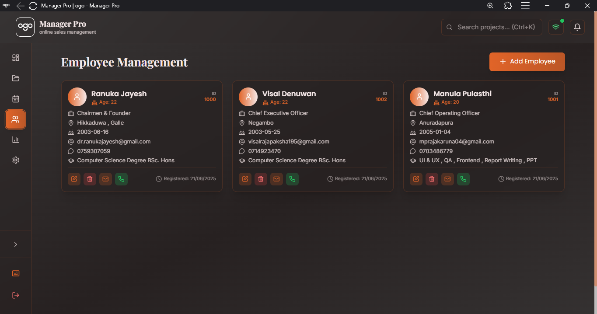
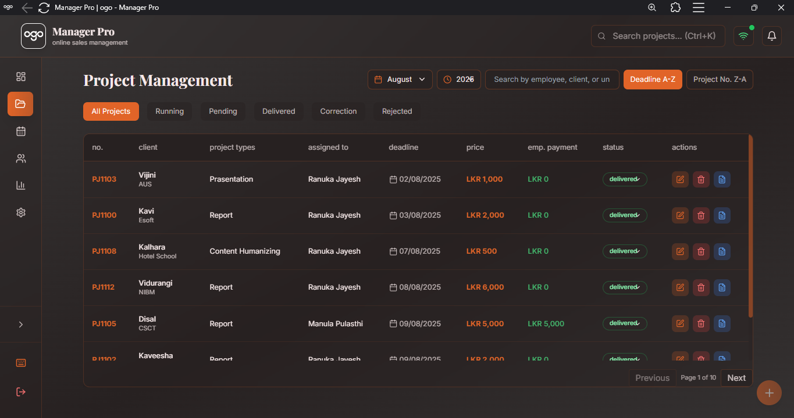
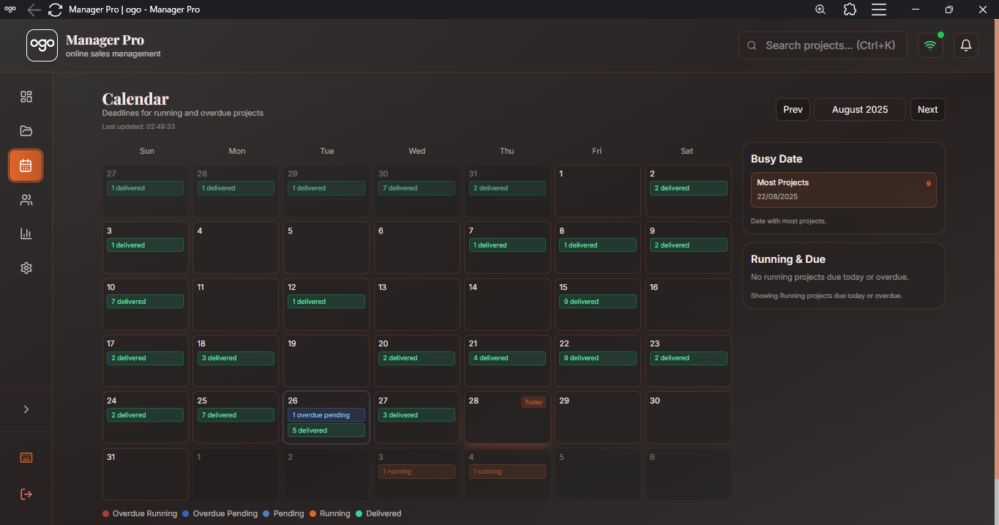
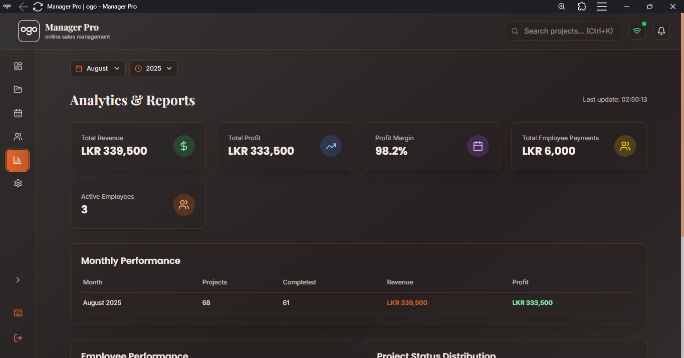

<h1 align="center">🚀 OGO Manager</h1>

  <b>OGO Manager</b> is a modern, full-stack <b>Project & Employee Management System</b> built for <b>Ogo Technology</b>. 
  It delivers <b>real-time project tracking, financial insights, and performance analytics</b> — all inside a secure, responsive, and user-friendly interface.

  

<h2>🎯 Key Features</h2>

<ul>
  <li><b>🔐 Secure Authentication</b> Powered by Supabase with PostgreSQL & Row Level Security (RLS). Session management with auto-expiry & activity logging.</li>
  <li><b>📊 Dashboard & Analytics</b> Real-time revenue, employees, and project data. Dynamic filters with interactive charts (Chart.js & Recharts).</li>
  <li><b>📅 Calendar Module</b> Monthly project deadlines, color-coded statuses, and overdue indicators.</li>
  <li><b>👥 Employee Management</b> CRUD operations, performance metrics, and advanced search & filters.</li>
  <li><b>📁 Project Management</b> Full lifecycle, client/financial details, deadline tracking, and PDF receipts.</li>
  <li><b>📝 Reporting</b> Financial & employee analytics with exportable PDF reports (jsPDF & HTML2Canvas).</li>
  <li><b>⚙️ System Settings</b> Configurations, user preferences, backup & restore.</li>
  <li><b>📱 Responsive & Accessible</b> Glassmorphism UI, dark theme, mobile-first design, and accessibility compliance.</li>
</ul>

<h2>🖼️ Interface Screenshots</h2>

  
   <em>👥 Employee Management – CRUD operations & performance tracking</em>

  
   <em>📁 Project Tracking – Status, deadlines, and financials</em>

  
   <em>📅 Calendar – Color-coded deadlines and busy dates</em>

  
   <em>📝 Reports – PDF export with analytics & charts</em>

<h2>🧰 Tech Stack</h2>

<table>
  <tr>
    <th>Technology</th>
    <th>Description</th>
  </tr>
  <tr>
    <td> React 18 + TypeScript</td>
    <td>Type-safe frontend framework for modern UIs</td>
  </tr>
  <tr>
    <td> Vite</td>
    <td>Lightning-fast dev server & build tool</td>
  </tr>
  <tr>
    <td> Tailwind CSS</td>
    <td>Utility-first styling framework</td>
  </tr>
  <tr>
    <td> PostCSS</td>
    <td>CSS processing & compatibility</td>
  </tr>
  <tr>
    <td> ESLint</td>
    <td>Code linting & quality control</td>
  </tr>
  <tr>
    <td> Supabase</td>
    <td>PostgreSQL DB, authentication, real-time subscriptions</td>
  </tr>
  <tr>
    <td>📊 Chart.js & Recharts</td>
    <td>Data visualization & analytics</td>
  </tr>
  <tr>
    <td>🖼️ HTML2Canvas & jsPDF</td>
    <td>PDF report generation</td>
  </tr>
  <tr>
    <td>⚛️ Custom React Hooks</td>
    <td>State management & real-time updates</td>
  </tr>
</table>

<h2>📊 Benefits</h2>

<h3>✅ For Management</h3>
<ul>
  <li>Real-time insights into <b>projects, employees & revenue</b></li>
  <li><b>Data-driven decision making</b> with live analytics</li>
  <li><b>Financial control</b> with profit & revenue monitoring</li>
</ul>

<h3>✅ For Operations</h3>
<ul>
  <li>Streamlined workflows with integrated modules</li>
  <li>Automated updates with real-time synchronization</li>
  <li>Mobile-first design with secure, admin-only access</li>
</ul>

<h2>📫 Connect with Us</h2>

  
  
  
  
  

<h2>🙏 Thank You</h2>

  Thank you for checking out <b>Ogo Technology’s Manager System</b> 🚀 
  If you find this project helpful, please ⭐ the repo, open issues, or contribute.

©️ 2025 Ogo Technology. All rights reserved.

