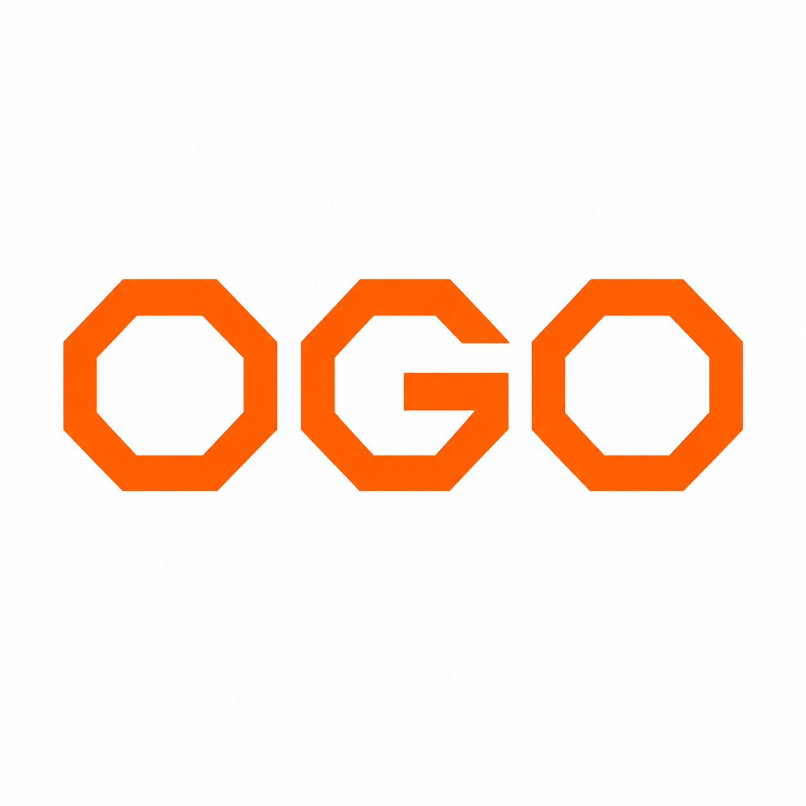
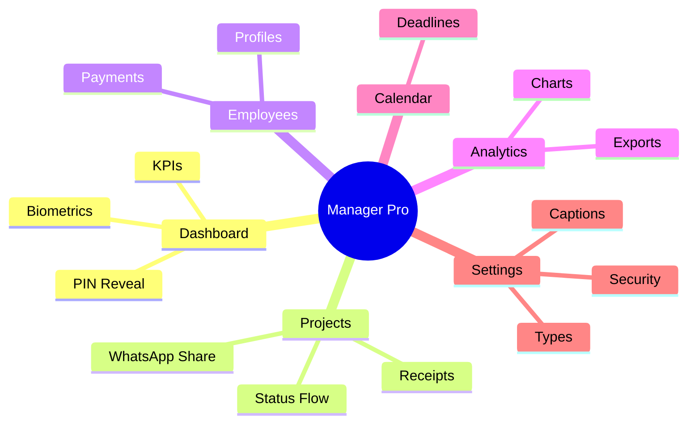
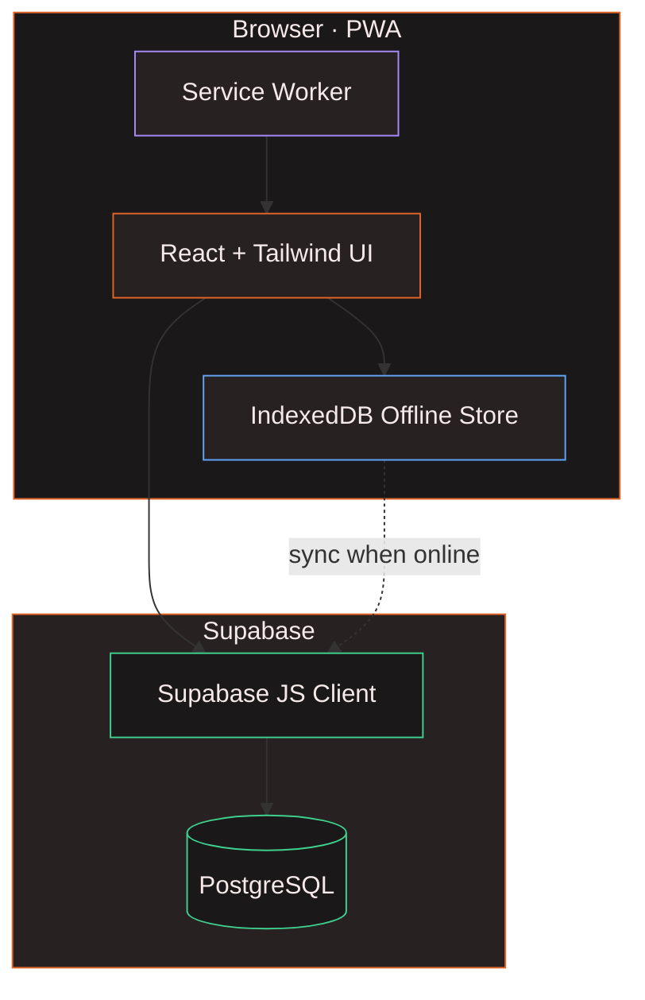
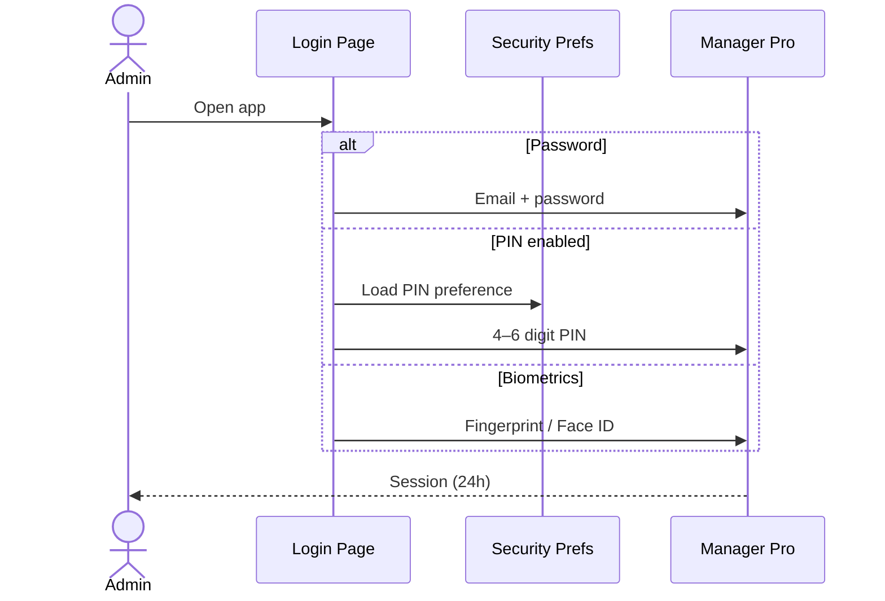
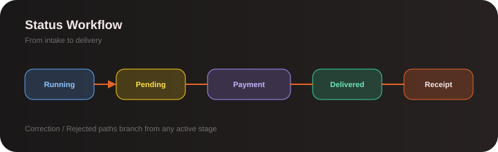
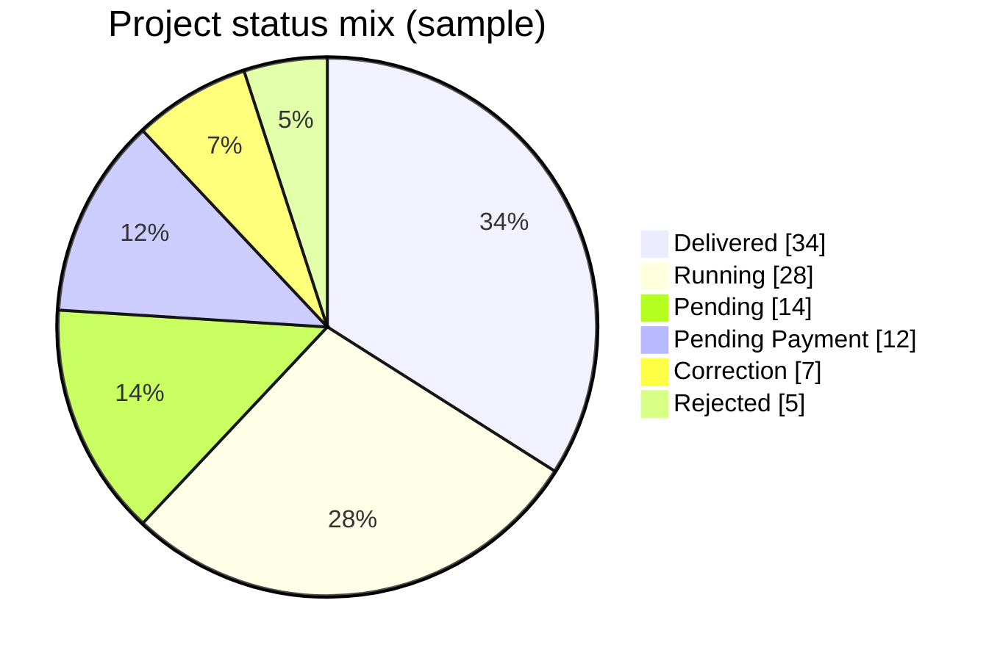
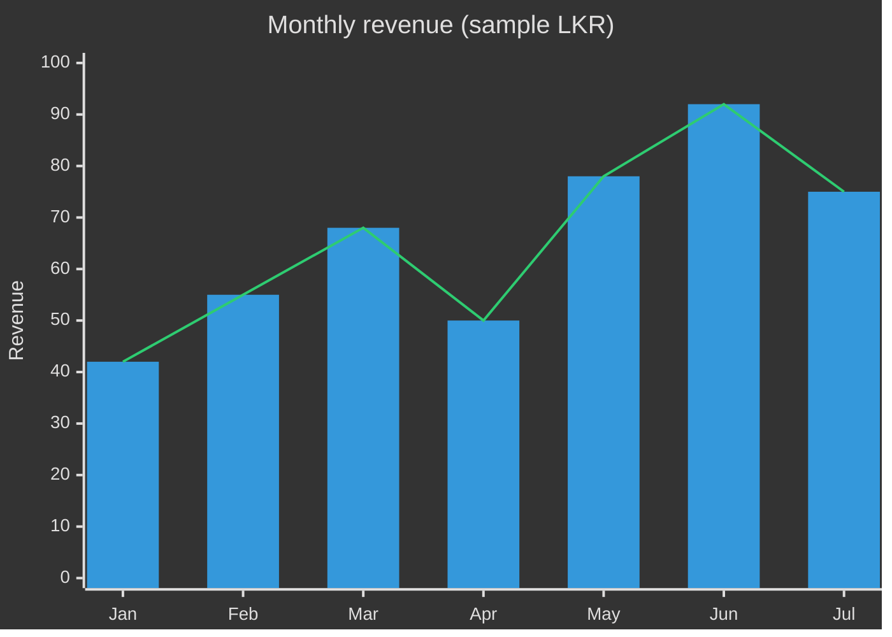
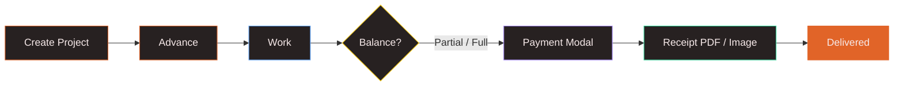

<!-- OGO Manager Pro — GitHub README -->
<p align="center">
  
</p>

<p align="center">
  
  &nbsp;&nbsp;
  
  &nbsp;&nbsp;
  
</p>

<h1 align="center">OGO · Manager Pro</h1>

<p align="center">
  <b>Next-gen sales &amp; project operations</b> for OGO Technology<br/>
  Projects · People · Payments · Analytics — offline-ready PWA
</p>

<p align="center">
  <a href="#-interactive-tour"></a>
  <a href="#-quick-start"></a>
  <a href="#-live-preview"></a>
</p>

<p align="center">
  
  
  
  
  
  
  
  
</p>

<p align="center">
  
</p>

---

## 🎛 Interactive tour

> Click each section to expand — designed for GitHub reading.

<details open>
<summary><b>① What is Manager Pro?</b></summary>
<br/>

**Manager Pro** is OGO Technology’s operations cockpit: one dark, brand-forward workspace to run client projects from intake → payment → delivery.

| Pillar | What you get |
|:------:|--------------|
| 📊 | Live dashboard KPIs with PIN / biometric reveal |
| 📋 | Full project board + mobile cards |
| 👥 | Employee profiles & payment allocations |
| 📈 | Analytics, exports, calendar deadlines |
| 🔐 | Password · PIN · Fingerprint / Face ID |
| 📴 | Offline cache + sync when back online |

</details>

<details>
<summary><b>② Feature map</b></summary>
<br/>



</details>

<details>
<summary><b>③ Architecture</b></summary>
<br/>



</details>

<details>
<summary><b>④ Auth paths</b></summary>
<br/>



</details>

---

## 🖼 Live preview

<p align="center">
  
</p>
<p align="center"><sub>Desktop login · brand photography + password / PIN tabs</sub></p>

<p align="center">
  
  &nbsp;&nbsp;
  
</p>
<p align="center"><sub>Mobile login experience · OGO wordmark</sub></p>

---

## 📊 Charts & insights

Brand-styled visuals included for docs and GitHub — mirrors what Analytics / Dashboard communicate inside the app.

<p align="center">
  
</p>

<p align="center">
  
</p>

<p align="center">
  
</p>

<details>
<summary><b>Interactive Mermaid · status mix</b></summary>
<br/>



</details>

<details>
<summary><b>Interactive Mermaid · monthly revenue</b></summary>
<br/>



</details>

---

## ✨ Capabilities

<table>
<tr>
<td width="33%" align="center">

### 🏠 Dashboard  
KPI cards · reveal lock  
PIN / Face ID unlock  

</td>
<td width="33%" align="center">

### 📋 Projects  
Status workflow · filters  
Receipts & sharing  

</td>
<td width="33%" align="center">

### 👥 Employees  
Profiles · assignments  
Partial payments  

</td>
</tr>
<tr>
<td width="33%" align="center">

### 📈 Analytics  
Charts · periods  
Export reports  

</td>
<td width="33%" align="center">

### 📅 Calendar  
Deadline radar  
Status colors  

</td>
<td width="33%" align="center">

### ⚙️ Settings  
Types · captions  
Security toggles  

</td>
</tr>
</table>

<details>
<summary><b>Payment & receipt flow</b></summary>
<br/>



</details>

---

## 🚀 Quick start

<details open>
<summary><b>Install & run</b></summary>
<br/>

```bash
# 1) Clone
git clone https://github.com/<your-org>/ogo-manager.git
cd ogo-manager

# 2) Install
npm install

# 3) Point Supabase client
#    edit → src/supabaseClient.ts

# 4) Dev server
npm run dev
# → http://localhost:5173
```

| Command | Purpose |
|---------|---------|
| `npm run dev` | Local HMR server |
| `npm run build` | Production bundle |
| `npm run preview` | Preview `dist/` |
| `npm run lint` | ESLint |

</details>

<details>
<summary><b>Security SQL (PIN / biometrics)</b></summary>
<br/>

Run in Supabase SQL Editor once:

```sql
-- supabase-admin-security.sql
alter table public.admin
  add column if not exists pin_hash text,
  add column if not exists pin_enabled boolean default false,
  add column if not exists biometric_enabled boolean default false;
```

Then open **Settings → Security** in the app.

</details>

<details>
<summary><b>Database folder</b></summary>
<br/>

Apply from [`DB/`](DB/) as needed:

| Script | Role |
|--------|------|
| `database_schema.sql` | Core schema |
| `projects_table.sql` | Projects |
| `migration_employee_payments*.sql` | Employee payments |
| `migration_give_discount.sql` | Discounts |
| `analytics_comparison_table.sql` | Analytics |
| `export_reports_table.sql` | Exports |

</details>

---

## 🎨 Brand system

<p align="center">
  
  &nbsp;&nbsp;&nbsp;
  
  &nbsp;&nbsp;&nbsp;
  
  &nbsp;&nbsp;&nbsp;
  
</p>

| Token | Hex | Preview |
|-------|-----|---------|
| Primary | `#E16428` |  |
| Surface | `#272121` |  |
| Deep | `#1a1818` |  |
| Text | `#F6E9E9` |  |

**Type:** Playfair Display · Poppins · Inter

---

## ⌨️ Shortcuts

| Keys | Action |
|------|--------|
| <kbd>Alt</kbd> + <kbd>1</kbd>–<kbd>6</kbd> | Switch main tabs |
| <kbd>Alt</kbd> + <kbd>A</kbd> | Add project |
| <kbd>Alt</kbd> + <kbd>L</kbd> | Logout |
| <kbd>Esc</kbd> | Close / cancel |
| <kbd>Enter</kbd> | Confirm logout |

---

## 📁 Structure

```text
ogo-manager/
├── public/                 # Logos · login art · PWA
│   ├── 2OGOlogo.png
│   ├── logo.gif
│   ├── logo_ogo.png
│   ├── app.png
│   ├── pclogin.webp
│   └── mobilelogin.webp
├── docs/assets/            # README charts (SVG)
│   ├── revenue-chart.svg
│   ├── status-chart.svg
│   └── workflow-chart.svg
├── DB/                     # SQL migrations
├── src/
│   ├── components/
│   ├── hooks/
│   ├── lib/
│   ├── utils/
│   └── supabaseClient.ts
└── supabase-admin-security.sql
```

---

## 🌐 Deploy

<details>
<summary><b>Netlify</b></summary>

```text
Build:   npm run build
Publish: dist
```

Config also lives under `public/netlify.toml`.

</details>

<details>
<summary><b>Vercel</b></summary>

```bash
npm i -g vercel
vercel --prod
```

Confirm production uses the correct Supabase project.

</details>

---

## 🤝 Contribute

1. Fork → branch `feature/your-idea`  
2. Match the dark / `#E16428` system  
3. PR with [`.github/pull_request_template.md`](.github/pull_request_template.md)  

See [`CONTRIBUTING.md`](CONTRIBUTING.md) · [`CHANGELOG.md`](CHANGELOG.md)

---

## 📄 License

[MIT](LICENSE) © 2024–2026 **OGO Technology**

---

<p align="center">
  
</p>

<p align="center">
  <br/><br/>
  <b>Manager Pro · V.26</b><br/>
  <sub>Built for real operations — projects, people, payments.</sub>
</p>

<p align="center">
  <a href="#-interactive-tour"></a>
</p>
