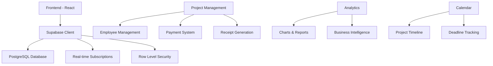

# 🚀 OGO Manager Pro

<div align="center">


**A Comprehensive Project Management System for OGO Technology**

[](https://reactjs.org/)
[](https://www.typescriptlang.org/)
[](https://supabase.com/)
[](https://tailwindcss.com/)
[](https://vitejs.dev/)

[](LICENSE)
[](CONTRIBUTING.md)

</div>

---

## 📋 Table of Contents

- [✨ Features](#-features)
- [🛠️ Tech Stack](#️-tech-stack)
- [🚀 Quick Start](#-quick-start)
- [📱 Screenshots](#-screenshots)
- [🏗️ Architecture](#️-architecture)
- [💼 Business Features](#-business-features)
- [🔧 Development](#-development)
- [📊 Database Schema](#-database-schema)
- [🤝 Contributing](#-contributing)
- [📄 License](#-license)

---

## ✨ Features

### 🎯 **Core Management**
- **📊 Dashboard** - Real-time analytics and metrics
- **👥 Employee Management** - Complete HR system
- **📋 Project Management** - End-to-end project lifecycle
- **📅 Calendar Integration** - Visual project timeline
- **📈 Analytics** - Business intelligence and reporting

### 💰 **Advanced Payment System**
- **💳 Smart Payment Tracking** - Advance and balance calculations
- **🔄 Partial Payment Support** - Flexible payment options
- **📄 Professional Receipts** - Auto-generated PDF receipts
- **⚡ Fast Delivery Options** - Premium service indicators
- **📊 Financial Analytics** - Revenue and profit tracking

### 🎨 **Modern UI/UX**
- **🌙 Dark Theme** - Professional dark interface
- **📱 Responsive Design** - Mobile-first approach
- **✨ Smooth Animations** - Framer Motion powered
- **🎯 Glass Morphism** - Modern visual effects
- **⌨️ Keyboard Shortcuts** - Enhanced productivity

### 🔒 **Security & Performance**
- **🔐 Row Level Security** - Supabase RLS protection
- **⚡ Real-time Updates** - Live data synchronization
- **🛡️ Input Validation** - TypeScript type safety
- **📝 Audit Logging** - Complete activity tracking

---

## 🛠️ Tech Stack

### **Frontend**
```typescript
React 18.3.1          // UI Framework
TypeScript 5.5.3      // Type Safety
Vite 5.4.2           // Build Tool
Tailwind CSS 3.4.1   // Styling
Framer Motion 12.18.1 // Animations
```

### **Backend & Database**
```typescript
Supabase 2.50.0       // Backend as a Service
PostgreSQL            // Database
Row Level Security    // Data Protection
Real-time Subscriptions // Live Updates
```

### **Key Libraries**
```typescript
Chart.js 4.5.0        // Data Visualization
html2canvas 1.4.1     // Receipt Generation
jsPDF 3.0.1          // PDF Creation
Lucide React 0.344.0  // Icons
Recharts 2.15.4      // Advanced Charts
```

---

## 🚀 Quick Start

### **Prerequisites**
- Node.js 18+ 
- npm or yarn
- Supabase account

### **Installation**

1. **Clone the repository**
```bash
git clone https://github.com/yourusername/ogo-manager.git
cd ogo-manager
```

2. **Install dependencies**
```bash
npm install
# or
yarn install
```

3. **Environment Setup**
```bash
# Create .env.local file
VITE_SUPABASE_URL=your_supabase_url
VITE_SUPABASE_ANON_KEY=your_supabase_anon_key
```

4. **Database Setup**
```bash
# Run the database schema
psql -h your_host -U your_user -d your_database -f DB/database_schema.sql
```

5. **Start Development Server**
```bash
npm run dev
# or
yarn dev
```

6. **Open in Browser**
```
http://localhost:5173
```

---

## 📱 Screenshots

### 🏠 Dashboard
<div align="center">

</div>

### 📋 Project Management
<div align="center">

</div>

### 📄 Professional Receipts
<div align="center">

</div>

---

## 🏗️ Architecture



---

## 💼 Business Features

### 📊 **Financial Management**
- **Revenue Tracking** - Monthly and yearly revenue analysis
- **Profit Margins** - Detailed profit calculations
- **Employee Payments** - Salary and commission tracking
- **Pending Payments** - Outstanding balance management

### 🎯 **Project Lifecycle**
- **Status Management** - Running → Pending Payment → Delivered
- **Payment Automation** - Smart payment confirmation
- **Fast Delivery** - Premium service with crown indicators
- **Deadline Tracking** - Visual calendar integration

### 📈 **Analytics & Reporting**
- **Unique Client Count** - Customer base analysis
- **Project Completion Rates** - Performance metrics
- **Most Busy Days** - Workload distribution
- **Revenue Trends** - Financial forecasting

---

## 🔧 Development

### **Available Scripts**
```bash
npm run dev          # Start development server
npm run build        # Build for production
npm run preview      # Preview production build
npm run lint         # Run ESLint
```

### **Project Structure**
```
src/
├── components/          # React components
│   ├── Dashboard.tsx    # Main dashboard
│   ├── ProjectManagement.tsx
│   ├── EmployeeManagement.tsx
│   ├── Calendar.tsx
│   └── Analytics.tsx
├── hooks/              # Custom React hooks
├── types/              # TypeScript interfaces
└── supabaseClient.ts   # Database connection

DB/
├── database_schema.sql  # Database structure
└── projects_table.sql   # Projects table definition
```

---

## 📊 Database Schema

### **Core Tables**

```sql
-- Employees Table
CREATE TABLE employees (
    id UUID PRIMARY KEY,
    employee_id VARCHAR(50) UNIQUE,
    first_name VARCHAR(100),
    last_name VARCHAR(100),
    position VARCHAR(100),
    -- ... more fields
);

-- Projects Table  
CREATE TABLE projects (
    id UUID PRIMARY KEY,
    project_id VARCHAR(50) UNIQUE,
    client_name VARCHAR(255),
    price DECIMAL(10,2),
    advance DECIMAL(10,2),
    balance DECIMAL(10,2),
    status VARCHAR(20) CHECK (status IN ('Running', 'Pending', 'Pending Payment', 'Delivered', 'Correction', 'Rejected')),
    fast_deliver BOOLEAN DEFAULT FALSE,
    -- ... more fields
);
```

---

## 🎨 Design System

### **Color Palette**
```css
Primary: #E16428    /* Orange accent */
Background: #1a1818 /* Dark background */
Surface: #272121    /* Card background */
Text: #F6E9E9      /* Light text */
```

### **Typography**
```css
Headings: 'Playfair Display'  /* Elegant serif */
Body: 'Inter'                 /* Clean sans-serif */
UI: 'Poppins'                /* Modern sans-serif */
```

---

## 🚀 Deployment

### **Vercel Deployment**
```bash
# Install Vercel CLI
npm i -g vercel

# Deploy
vercel --prod
```

### **Environment Variables**
```env
VITE_SUPABASE_URL=your_supabase_url
VITE_SUPABASE_ANON_KEY=your_supabase_anon_key
```

---

## 🤝 Contributing

We welcome contributions! Please see our [Contributing Guidelines](CONTRIBUTING.md) for details.

### **Development Workflow**
1. Fork the repository
2. Create a feature branch (`git checkout -b feature/amazing-feature`)
3. Commit your changes (`git commit -m 'Add amazing feature'`)
4. Push to the branch (`git push origin feature/amazing-feature`)
5. Open a Pull Request

---

## 📄 License

This project is licensed under the MIT License - see the [LICENSE](LICENSE) file for details.

---

## 🙏 Acknowledgments

- **OGO Technology** - For the amazing project requirements
- **Supabase** - For the incredible backend platform
- **React Community** - For the excellent ecosystem
- **Tailwind CSS** - For the beautiful design system

---

<div align="center">

**Made with ❤️ by OGO Technology Team**

[🌐 Website](https://ogo.technology) • [📧 Contact](mailto:contact@ogo.technology) • [🐛 Report Bug](https://github.com/yourusername/ogo-manager/issues)

</div>
